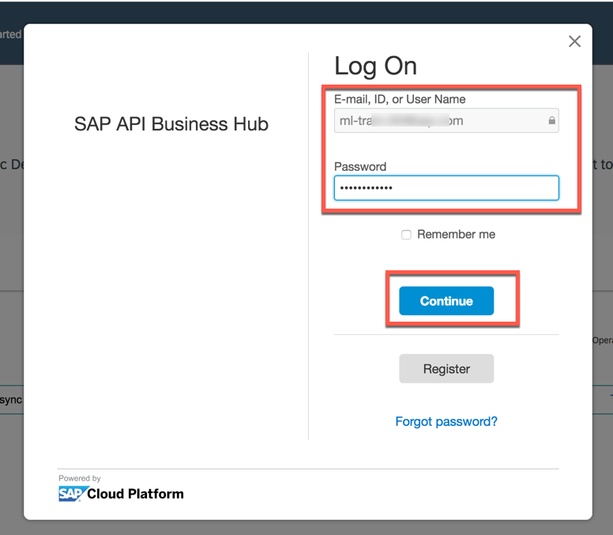

<table width=100% border=>
<tr><td colspan=2><h1>EXERCISE 05 - Explore translation APIs on SAP API Business hub</h1></td></tr>
<tr><td><h3>SAP Presales Workshop</h3></td><td><h1> &nbsp;20 min</h1></td></tr>
</table>


## Description
In this exercise, you’ll learn how

* to test SAP Translation Hub APIS from SAP API Business Hub sandbox

## Target group

* Developers
* People interested in SAP API Business Hub and API Management


## Goal

In this exercise you can experience how easy it is to explore and use the available API's on SAP API Business Hub. This specific example targets at using the SAP Translation Hub APIs to translate User name into Portuguese


## Prerequisites

Here below are prerequisites for this exercise.

* A trial account on the SAP Cloud Platform. You can get one by registering here <https://account.hanatrial.ondemand.com>

## Steps

1. [Explore SAP Translation Hub API's on API Business Hub](#topic-detection)


### <a name="topic-detection"></a> Explore SAP Translation Hub API's on API Business Hub
1. Open SAP Business Hub in your browser <https://api.sap.com>  
	

	>NOTE: Please use Firefox to avoid the SSO login [for SAP Employees only].

1. 	Click on **Try New Design** so that you can start trying the new design has been rolled out for the API Hub  
	

1. We need to login to test the service: click on the **Log On** button at the top right corner  
	

1. Enter the credentials provided by your instructor/Your P/S user/pwd and click **Continue**  
  

1. 	Select the checkbox **API Package** in the Refine By section on left hand side. Enter the text "translation" in the search box, hit ENTER and choose **SAP Translation Hub** API Package
	

1. Select the **SAP Translation Hub** under APIs
	

1. Click on **Translate** under API References section
  	

1. We see the supported operation Post, Click on **POST** request (*Note: 11.	Description about the Translate resource, like required parameters to be passed to try-out API are maintained*)
	

1. Scroll down to the **PARAMETERS** and under **translate**, paste the following parameters and click on **Try out** button

	```json
  {
  "targetLanguages": [
    "pt"
  ],
  "enableMT": true,
  "enableTranslationQualityEstimation": true,
  "domain": "B2",
  "units": [
    {
      "textType": "XFLD",

      "key": "LOGIN_USERNAME_FIELD",
      "value": "User Name"
         }
  ]
}
	```
	

1. You should receive a **Response Code** of **200**. Check the result in the **Response Body**: you should now see that the User Name is translated to Portuguese  "Nome do usuário", you should see a content like this  
	

1. Congratulations! You have completed the exercise.


## Summary
This concludes the exercise. You should have learned how to explore and test API's available on SAP API Business Hub.

You are now able to:

* Browse through API Business Hub to find the SAP Translation Hub APIs
* Test the APIs on API Business Hub

Please proceed with the next exercise.
